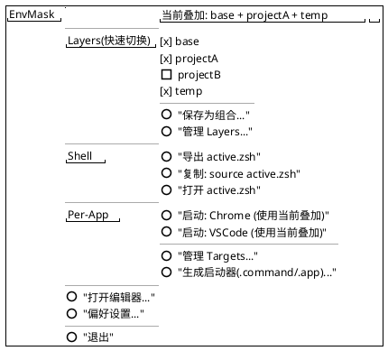
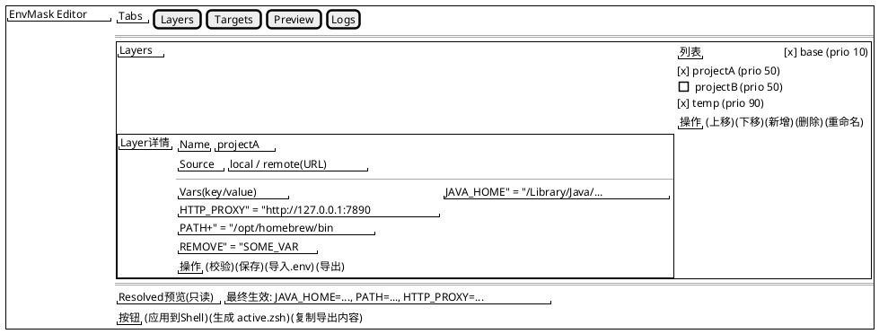

# EnvMask UI 菜单草图（PlantUML）

> 目标：参考 Gas Mask 的交互习惯，做一个“分层环境变量管理”的菜单栏工具，支持 Shell-only 与 per-app 启动器。

## 菜单栏菜单（草图）

```plantuml
@startuml
salt
{
  {+
    "EnvMask" {
      {#} "当前叠加: base + projectA + temp" | " "
      --
      "Layers(快速切换)" {
        [x] base
        [x] projectA
        [ ] projectB
        [x] temp
        ---
        ( ) "保存为组合..."
        ( ) "管理 Layers..."
      }
      --
      "Shell" {
        ( ) "导出 active.zsh"
        ( ) "复制: source active.zsh"
        ( ) "打开 active.zsh"
      }
      --
      "Per-App" {
        ( ) "启动: Chrome (使用当前叠加)"
        ( ) "启动: VSCode (使用当前叠加)"
        ---
        ( ) "管理 Targets..."
        ( ) "生成启动器(.command/.app)..."
      }
      --
      ( ) "打开编辑器..."
      ( ) "偏好设置..."
      --
      ( ) "退出"
    }
  }
}
@enduml
```

## 主编辑器窗口（草图）

```plantuml
@startuml
salt
{
  {+
    "EnvMask Editor" {
      { "Tabs" | [Layers] | [Targets] | [Preview] | [Logs] }
      ==
      {
        {+
          "Layers" {
            { "列表" |
              [x] base (prio 10)
              [x] projectA (prio 50)
              [ ] projectB (prio 50)
              [x] temp (prio 90)
            }
            { "操作" | (上移) | (下移) | (新增) | (删除) | (重命名) }
          }
        |
          {+
            "Layer详情" {
              { "Name" | "projectA" }
              { "Source" | "local / remote(URL)" }
              --
              { "Vars(key/value)" |
                "JAVA_HOME" = "/Library/Java/..."
                "HTTP_PROXY" = "http://127.0.0.1:7890"
                "PATH+" = "/opt/homebrew/bin"
                "REMOVE" = "SOME_VAR"
              }
              { "操作" | (校验) | (保存) | (导入.env) | (导出) }
            }
          }
        }
      }
      ==
      { "Resolved预览(只读)" |
        "最终生效: JAVA_HOME=..., PATH=..., HTTP_PROXY=..."
      }
      { "按钮" | (应用到Shell) | (生成 active.zsh) | (复制导出内容) }
    }
  }
}
@enduml
```

